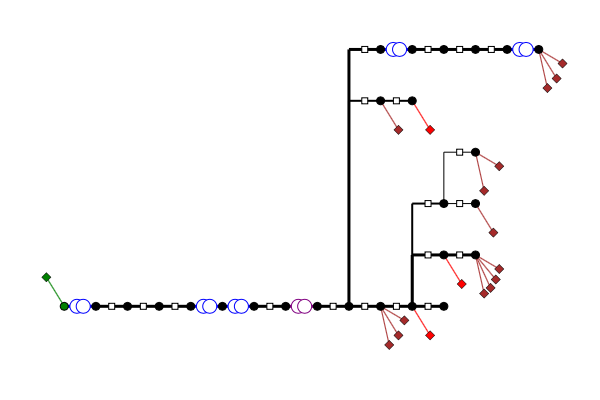
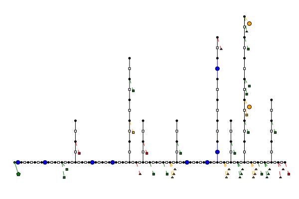
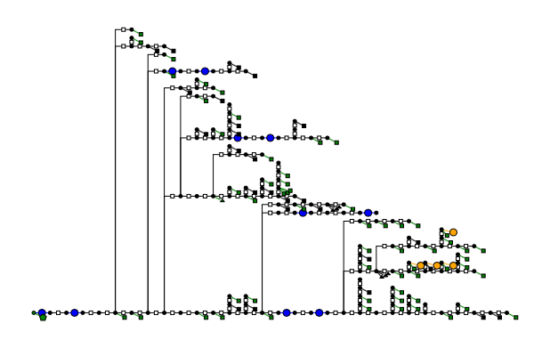

# DistributionTestCases.jl
This package contains distribution test cases for use with [PowerModelsDistribution.jl](https://github.com/lanl-ansi/PowerModelsDistribution.jl) (PMD). Additionally, it contains utilities for
- comparing power flow results of PMD and OpenDSS, obtained with the help of OpenDSSDirect.jl,
- plotting PMD data files representing radial networks.

## Installation
You can install this package itself by executing the following in Julia REPL.
```
]add https://github.com/sanderclaeys/DistributionTestCases.jl
```
## Usage
The package contains the data files for each test case. A path to the master dss file for each test case, is contained in the constant `CASE_PATH`. This path can be passed to the PMD OpenDSS parser to obtain a PMD data model. For example,
```
import DistributionTestCases
DTC = DistributionTestCases
import PowerModelsDistribution
PMD = PowerModelsDistribution

path = DTC.CASE_PATH["IEEE13"]
data_pmd = PMD.parse_file(path)
```
Similarly, you can obtain IEEE34, IEEE123, and LVTestCase. Note that LVTestCase is a dynamic profile and therefore you further need to specify the time step; PMD does not support parsing load profiles.
```
data_pmd_IEEE34 = PMD.parse_file(DTC.CASE_PATH["IEEE34"])
data_pmd_IEEE123 = PMD.parse_file(DTC.CASE_PATH["IEEE123"])
data_pmd_LVTestCase_t1000 = PMD.parse_file(DTC.CASE_PATH["LVTestCase"][1000])
```
You can obtain a simplified version of the feeders. This will only contain the base components (branches, shunt and wye-connected constant power loads), which are supported by all formulations. Delta-connected loads are converted to wye-connected loads, by calculating which power they would draw at the bus to which they are connected under balanced conditions.
```
data_pmd = PMD.parse_file(DTC.CASE_PATH["IEEE13"])
DTC.simplify_feeder!(data_pmd)
```
Finally, some experimental topology plotting. This should only be used for radial
feeders. The Plotly backend is preferred, as it shows the id of elements when
you hover over them.
```
# example for IEEE13
import Plots
Plots.plotly()
data_pmd = PMD.parse_file(DTC.CASE_PATH["IEEE13"])
coords = PMD.get_bus_coords(data_pmd)
PMD.draw_topology(data_pmd, coords)
```
<p align="center"></p>

## Validation
Test feeders are validated by comparing all bus voltage magnitudes. When a bus is galvanically isolated from the ground, the phase-to-phase voltages are compared instead of the phase-to-ground voltages. (Needed for bus 610 in IEEE123)

## Included test feeders
The numerical results mentioned in this table, were obtained with Ipopt setting `tol=1E-10` and an OpenDSS convergence tolerance of `1E-6`. See the `test/runtests.jl` for the details.

|publisher|name|status|files|OpenDSS|
|---    |---    |---        |---|---|
|IEEE   |IEEE13 |validated (5.1E-8) |[zip](http://sites.ieee.org/pes-testfeeders/files/2017/08/feeder13.zip)|[@GitHub](https://github.com/tshort/OpenDSS/blob/master/Test/IEEE13_Assets.dss) |
|IEEE   |IEEE34 |validated (1.4E-7)    |[zip](http://sites.ieee.org/pes-testfeeders/files/2017/08/feeder34.zip)  |[@GitHub](https://github.com/tshort/OpenDSS/tree/master/Distrib/IEEETestCases/34Bus)   |
|IEEE   |IEEE37 |planned    |[zip](http://sites.ieee.org/pes-testfeeders/files/2017/08/feeder37.zip)  |[@GitHub](https://github.com/tshort/OpenDSS/tree/master/Distrib/IEEETestCases/37Bus)   |
|IEEE   |IEEE123 |validated (1.3E-8)   |[zip](http://sites.ieee.org/pes-testfeeders/files/2017/08/feeder123.zip)  |[@GitHub](https://github.com/tshort/OpenDSS/tree/master/Distrib/IEEETestCases/123Bus)   |
|IEEE   |LVTestCase |validated (3.4E-8 at t=1000)   | |[@GitHub](https://github.com/tshort/OpenDSS/tree/master/Distrib/IEEETestCases/LVTestCase) |

### IEEE13
"This circuit model is very small and used to test common features of distribution analysis software, operating at 4.16 kV. It is characterized by being short, relatively highly loaded, a single voltage regulator at the substation, overhead and underground lines, shunt capacitors, an in-line transformer, and unbalanced loading." [[source]](http://sites.ieee.org/pes-testfeeders/resources/)

<p align="center"></p>

### IEEE34
"This feeder is an actual feeder located in Arizona, with a nominal voltage of 24.9 kV. It is characterized by long and lightly loaded, two in-line regulators, an in-line transformer for short 4.16 kV section, unbalanced loading, and shunt capacitors." [[source]](http://sites.ieee.org/pes-testfeeders/resources/)

<p align="center"></p>

### IEEE37
"This feeder is an actual feeder in California, with a 4.8 kV operating voltage. It is characterized by delta configured, all line segments are underground, substation voltage regulation is two single-phase open-delta regulators, spot loads, and very unbalanced. This circuit configuration is fairly uncommon." [[source]](http://sites.ieee.org/pes-testfeeders/resources/)

### IEEE123
"The IEEE 123 node test feeder operates at a nominal voltage of 4.16 kV. While this is not a popular voltage level it does provide voltage drop problems that must be solved with the application of voltage regulators and shunt capacitors. This circuit is characterized by overhead and underground lines, unbalanced loading with constant current, impedance, and power, four voltage regulators, shunt capacitor banks, and multiple switches.This circuit is “well-behaved” with minimal convergence problems." [[source]](http://sites.ieee.org/pes-testfeeders/resources/)

<p align="center"></p>
