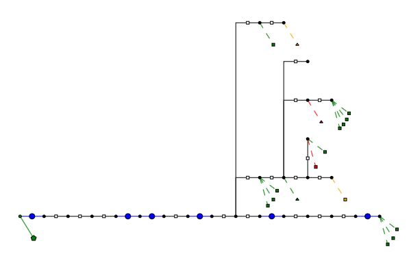

# PMDTestFeeders
Generates and validates TPPM data models for common test feeders. Some of these require some adjustment after the call to the OpenDSS parser, and are therefore contained here for now.

## Installation
You can install this package itself by executing the following in Julia REPL. This will prompt for your GitHub credentials, because this is a private repository for now.
```
]add https://github.com/sanderclaeys/PMDTestFeeders.jl
```
## Usage
You can obtain a PMD data model by executing the following. This will parse the original OpenDSS IEEE13 implementation, and apply
a few transformations in post-processing. This is needed because the OpenDSS
parser does not support all of the features available in TPPM.
```
import PMDTestFeeders
data_pmd = PMDTestFeeders.get_ieee13()
# Don't forget to add voltage bounds and line bounds!
# These are not included in the original specification
```
Similarly, you can obtain IEEE34, IEEE123, and LVTestCase.
```
data_pmd_ieee34 = PMDTestFeeders.get_ieee34()
data_pmd_ieee123 = PMDTestFeeders.get_ieee123()
# LVTestCase has profiles, so you have to specify the time.
data_pmd_lvtestcase = PMDTestFeeders.get_lvtestcase(t=1000)
```
You can obtain a simplified version of the feeders. This will only contain the base components (branches, shunt and wye-connected constant power loads), which are supported by all formulations. Delta-connected loads are converted to wye-connected loads, by calculating which power they would draw at the bus to which they are connected under balanced conditions.
```
data_pmd = PMDTestFeeders.get_ieee13()
PMDTestFeeders.simplify_feeder!(data_pmd)
```
Finally, some experimental topology plotting. This should only be used for radial
feeders. The Plotly backend is preferred, as it shows the id of elements when
you hover over them.
```
# example for IEEE13
import Plots
Plots.plotly()
data_pmd = PMDTestFeeders.get_ieee13()
coords = PMDTestFeeders.get_bus_coords(data_pmd)
PMDTestFeeders.draw_topology(data_pmd, coords)
```
<p align="center"></p>

## Validation
Test feeders are validated by comparing all bus voltage magnitudes.

## Included test feeders

|publisher|name|status|files|OpenDSS|
|---    |---    |---        |---|---|
|IEEE   |IEEE13 |validated (2E-6) |[zip](http://sites.ieee.org/pes-testfeeders/files/2017/08/feeder13.zip)|[@GitHub](https://github.com/tshort/OpenDSS/blob/master/Test/IEEE13_Assets.dss) |
|IEEE   |IEEE34 |validated (8.5E-7)    |[zip](http://sites.ieee.org/pes-testfeeders/files/2017/08/feeder34.zip)  |[@GitHub](https://github.com/tshort/OpenDSS/tree/master/Distrib/IEEETestCases/34Bus)   |
|IEEE   |IEEE37 |planned    |[zip](http://sites.ieee.org/pes-testfeeders/files/2017/08/feeder37.zip)  |[@GitHub](https://github.com/tshort/OpenDSS/tree/master/Distrib/IEEETestCases/37Bus)   |
|IEEE   |IEEE123 |validated (1E-4)   |[zip](http://sites.ieee.org/pes-testfeeders/files/2017/08/feeder123.zip)  |[@GitHub](https://github.com/tshort/OpenDSS/tree/master/Distrib/IEEETestCases/123Bus)   |
|IEEE   |LVTestCase |validated (1E-7)   | |[@GitHub](https://github.com/tshort/OpenDSS/tree/master/Distrib/IEEETestCases/LVTestCase) |

### IEEE13
"This circuit model is very small and used to test common features of distribution analysis software, operating at 4.16 kV. It is characterized by being short, relatively highly loaded, a single voltage regulator at the substation, overhead and underground lines, shunt capacitors, an in-line transformer, and unbalanced loading." [[source]](http://sites.ieee.org/pes-testfeeders/resources/)

<p align="center"></p>

### IEEE34
"This feeder is an actual feeder located in Arizona, with a nominal voltage of 24.9 kV. It is characterized by long and lightly loaded, two in-line regulators, an in-line transformer for short 4.16 kV section, unbalanced loading, and shunt capacitors." [[source]](http://sites.ieee.org/pes-testfeeders/resources/)

<p align="center"></p>

### IEEE37
"This feeder is an actual feeder in California, with a 4.8 kV operating voltage. It is characterized by delta configured, all line segments are underground, substation voltage regulation is two single-phase open-delta regulators, spot loads, and very unbalanced. This circuit configuration is fairly uncommon." [[source]](http://sites.ieee.org/pes-testfeeders/resources/)

### IEEE123
"The IEEE 123 node test feeder operates at a nominal voltage of 4.16 kV. While this is not a popular voltage level it does provide voltage drop problems that must be solved with the application of voltage regulators and shunt capacitors. This circuit is characterized by overhead and underground lines, unbalanced loading with constant current, impedance, and power, four voltage regulators, shunt capacitor banks, and multiple switches.This circuit is “well-behaved” with minimal convergence problems." [[source]](http://sites.ieee.org/pes-testfeeders/resources/)

<p align="center"></p>
